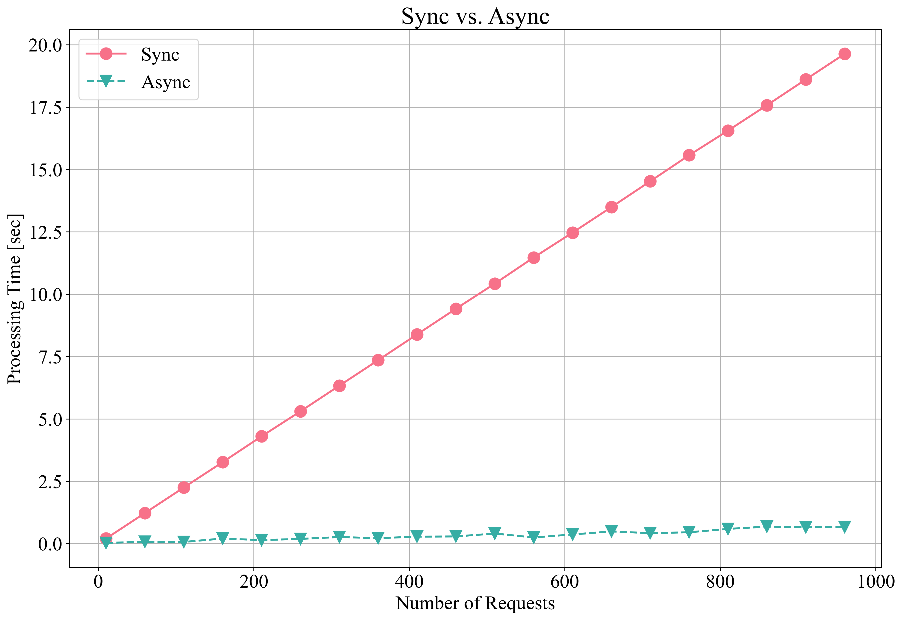

- [Setup](#setup)
- [String](#string)
- [Hash](#hash)
- [List](#list)
- [Set](#set)
- [Sorted Set](#sorted-set)
- [Key](#key)
- [Transaction](#transaction)
- [Pub/Sub](#pubsub)
- [Sync vs. Async](#sync-vs-async)

---

# Setup

```shell
pip install -r requirements.txt
```

```python
>>> import redis
>>> HOST = os.getenv("REDIS_HOST", "redis")
>>> PORT = int(os.getenv("REDIS_PORT", 6379))
>>> DB = int(os.getenv("REDIS_DB", 0))
>>> client = redis.Redis(host=HOST, port=PORT, db=DB)
>>> client
Redis<ConnectionPool<Connection<host=redis,port=6379,db=0>>>
>>> client.ping()
True
```

---

# String

```python
>>> client.set("name", "zerohertz")
True
>>> client.get("name")
b'zerohertz'
>>> client.get("name").decode("utf-8")
'zerohertz'
>>> client.append("name", "_test")
14
>>> client.get("name").decode("utf-8")
'zerohertz_test'
>>> client.strlen("name")
14
```

---

# Hash

```python
>>> client.hset("hash", "field1", "value1")
1
>>> client.hset("hash", "field2", "value2")
1
>>> client.hget("hash", "field1").decode("utf-8")
'value1'
>>> client.hgetall("hash")
{b'field1': b'value1', b'field2': b'value2'}
>>> client.hdel("hash", "field1")
1
>>> client.hgetall("hash")
{b'field2': b'value2'}
```

---

# List

```python
>>> client.lpush("list", "left_0")
1
>>> client.lpush("list", "left_1")
2
>>> client.rpush("list", "right_0")
3
>>> client.llen("list")
3
>>> client.lrange("list", 0, -1)
[b'left_1', b'left_0', b'right_0']
>>> client.lpop("list")
b'left_1'
>>> client.rpop("list")
b'right_0'
```

---

# Set

```python
>>> client.sadd("set", "value1")
1
>>> client.sadd("set", "value2")
1
>>> client.smembers("set")
{b'value1', b'value2'}
>>> client.sadd("set", "value1")
0
>>> client.smembers("set")
{b'value1', b'value2'}
>>> client.srem("set", "value1")
1
>>> client.smembers("set")
{b'value2'}
```

---

# Sorted Set

```python
>>> client.zadd("zset", {"value1": 1, "value2": 0})
2
>>> client.zrange("zset", 0, -1)
[b'value2', b'value1']
>>> client.zrange("zset", 0, -1, withscores=True)
[(b'value2', 0.0), (b'value1', 1.0)]
```

---

# Key

```python
>>> client.exists("key")
0
>>> client.exists("name")
1
>>> client.type("name")
b'string'
>>> client.type("hash")
b'hash'
>>> client.type("list")
b'list'
>>> client.type("set")
b'set'
>>> client.type("zset")
b'zset'
>>> client.delete("name")
1
>>> client.exists("name")
0
>>> client.keys("*")
[b'hash', b'list', b'key1', b'set', b'key2', b'zset']
```

---

# Transaction

```python
>>> with client.pipeline() as pipe:
...     pipe.set("key1", "value1")
...     pipe.set("key2", "value2")
...     pipe.execute()
...
Pipeline<ConnectionPool<Connection<host=redis,port=6379,db=0>>>
Pipeline<ConnectionPool<Connection<host=redis,port=6379,db=0>>>
[True, True]
```

---

# Pub/Sub

```python
# Pub
>>> client.publish("channel", "Hello, World!")
# Sub
>>> client.pubsub_channels()
[b'channel']
>>> pubsub = client.pubsub()
>>> pubsub.subscribe("channel")
>>> for msg in pubsub.listen():
...     print(msg)
...
{'type': 'message', 'pattern': None, 'channel': b'channel', 'data': b'Hello, World!'}
```


---

# Sync vs. Async


